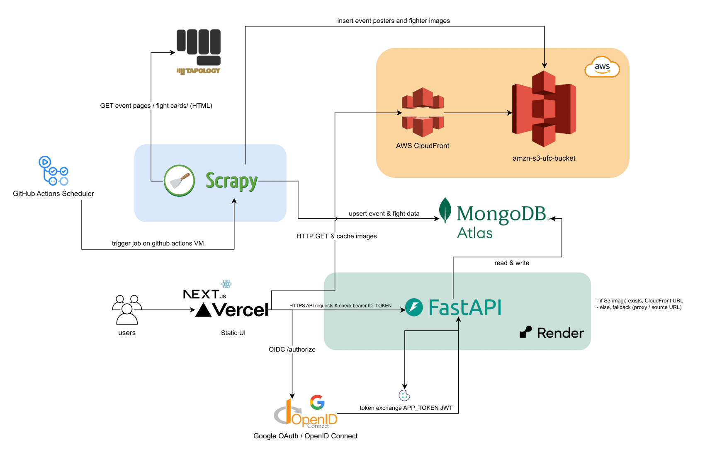

# UFC Picks – Distributed Prediction Platform
> **A full-stack system where users predict UFC fight outcomes and compete in real-time leaderboards. Designed with scalable architecture, automated data ingestion, and CI/CD-driven reliability.**

## Live System
**Frontend:** https://ufc-picks-frontend.vercel.app **Backend API:** Render Deployment 
**Database:** MongoDB Atlas 
**Storage/CDN:** AWS S3 + CloudFront 

##  Repositories

| Service | Repository |
|--------|------------|
|  Frontend | https://github.com/JoseZum/ufc-picks-frontend |
|  Backend | https://github.com/JoseZum/ufc-picks-backend |
|  Scraper | https://github.com/JoseZum/ufc-picks-scraper 

## Architecture Diagram

## Overview

UFC Picks is a production-style distributed web platform that allows users to predict UFC fight outcomes and compete through real-time leaderboards. Built with a scalable backend architecture, automated data ingestion, and cloud-based infrastructure, the system reflects real-world engineering concerns including reliability, security, and operational resilience.

This design ensures that the application remains functional even if the primary object storage is temporarily unavailable.

## Key Features

### Core Platform

- **Real-Time Predictions** – Users submit fight outcome predictions with validation rules

- **Dynamic Leaderboards** – Global and event-specific rankings updated after results

- **Rule-Based Scoring Engine** – Multi-tier scoring (perfect pick, method match, fighter match)

- **Event Locking System** – Predictions automatically locked once events begin

- **Google OAuth Authentication** – Secure identity with JWT-based API authorization

### Data & Automation

- **Automated Web Scraper** – Scrapy service extracts fight and event data

- **ETL Pipeline** – Data transformed, validated, and ingested into MongoDB

- **Cloud Image Storage** – Media uploaded to AWS S3 and distributed via CloudFront CDN

- **Scheduled Jobs** – GitHub Actions trigger ingestion jobs automatically

### Reliability & Safety

- **Stateless Backend Design** – Enables horizontal scaling

- **Graceful Degradation** – Image fallback strategy if S3 becomes unavailable

- **Health Check Endpoint** – Infrastructure monitoring support

- **Database Isolation in Testing** – Prevents race conditions in CI

### Engineering & DevOps

- **Layered Architecture** – Controllers, services, repositories, domain models

- **Async Backend** – FastAPI + Motor for non-blocking I/O

- **CI/CD Pipeline** – Automated tests, linting, type checking, security scans

- **Parallel Testing** – pytest-xdist for faster test execution

